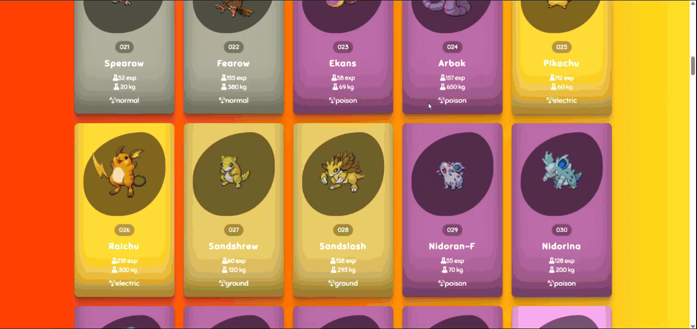

Pokedex Guide

 Pokedex Guide, HTML, CSS ve JavaScript kullanılarak geliştirilmiş interaktif bir Pokémon listeleme uygulamasıdır. Pokémon bilgileri PokeAPI üzerinden alınarak dinamik şekilde ekrana getirilir. 

🚀 Proje Özellikleri

🔎 Pokémon arama
🎨 Pokémon türüne göre kart renkleri
🖼️ Pokémon görselleri
⭐ Pokémon ID bilgisi
⚡ Base experience bilgisi
⚖️ Pokémon ağırlığı
🧪 Pokémon türü
✨ Hover animasyonları
📱 Responsive kart yapısı

 Kullanılan Teknolojiler

HTML

 Sayfanın temel yapısı oluşturuldu. Arama alanı, buton ve Pokémon kartlarının gösterileceği container HTML ile hazırlandı. 

CSS

 Sayfanın tasarımı CSS ile oluşturuldu. Gradient arka plan, kart tasarımı, gölgeler, hover efektleri ve arama kutusunun açılıp kapanma animasyonu kullanıldı. 

JavaScript

 JavaScript ile PokeAPI'den Pokémon verileri çekildi ve kartlar dinamik olarak oluşturuldu. Arama alanı sayesinde Pokémon isimleri filtrelenebilir hale getirildi. 

